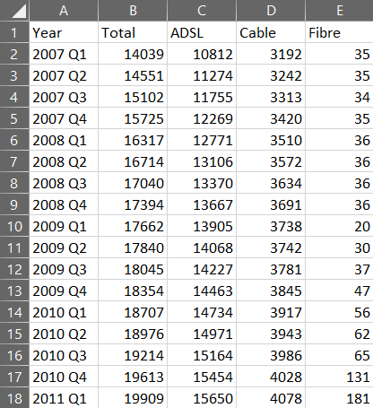
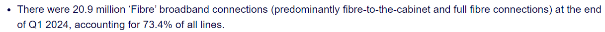
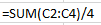
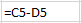
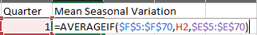
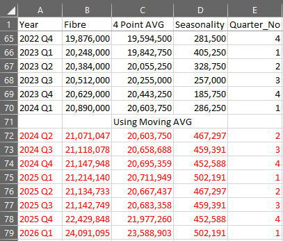
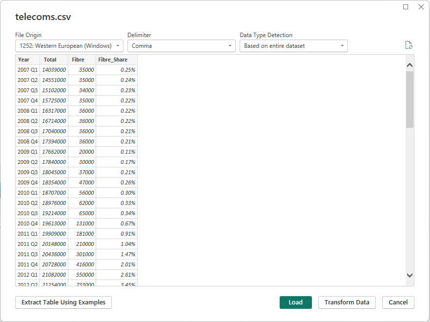

# Predictive Analysis of Uk Small Businesses and Residential Fibre Using Time Series

## Executive Summary

The Uk government has set targets for fibre broadband to be available to 85% of the Uk by 2025 and nationwide 2030 (Clark, 2023). To check whether or not the government will meet this target, I will apply a time series model to the following data set provided from Ofcom (Ofcom, 2024). This outcome of this project is to determine whether or not Uk Governments target is realistic. The results could affect not only affect economic performance (Sanyika and Roxburgh, 2011) but also voter confidence in meeting targets.
To ensure the success of the project I will follow a proven model (Yu, 2021), which will help with ensuring the accuracy of the data. Furthermore, so that I make sure to select the best trend which not only looks good but is conservative alongside the historical data. 

## Data Infrastructure & Tools
As the original file is in .CSV format, transformation was carried out in Excel. This made it easy to validate and transform the data. Being able to compare the results within EXCEL using graphs helps contribute towards the model. Next it was uploaded into Power BI for visualisation. This is because can Powerbase allows easy ingestion and can provide interactive graphs for visualisation.
The data was sourced from OFCOM (Wikipedia, 2019) which is a government approved regulatory. As a result, the data will have a higher accuracy and data integrity (Jones, 2024). Furthermore, as the data is open to the public this means it adheres to the latest GDPR regulations (Government of UK, 2018). 
As the model is using data during the Covid-19 period, this creates a challenge in providing an accurate prediction due to seasonal patterns which were not present pre-pandemic. This is why I’ve chosen to only forecast for 2 years.

## Data Engineering
As I followed a standard Extract Transform and Load (AWS, 2022) model, there are a number of processes I have to follow to ensure the adhere to the guidelines set. 

Dataset was downloaded from the Ofcom website and stored into a local directory. 
Although the dataset is from a government approved regulatory I will perform my own data integrity checks before transformation. To ensure data accuracy throughout the process.

First, I had to multiply the figures by 1000 as the table was showing smaller integers for ease of viewing. I also created a separate column to show % and compared with the footnotes given on the OFCOM website.

To check for NULL values, I used the “ISBLANK” function, and ran an integer check to make sure there were no STRINGS. This is because any NULL values can affect the results especially when working with trend lines and seasonal variations. 

Before transforming the data, I plotted the figures onto a Line graph to select the best trend line. There was no seasonality or cycles exhibited this could be due to not enough points during the fiscal year. This resulted in the moving average of 4 seemed to have the best fit. This also works well as there are 4 quarters in a fiscal year which creates 4 averages.
To work out the 4-point AVG firstly I had to work out the Trend, which is done by using the function below.

Next was to work out seasonality which is basically taking away the seasonality from the Fibre count

Using this we can work out the Mean seasonal variation for each fiscal quarter.

Now we can apply the mean seasonal variation to predict the future values.

Final step was to save the final output to CSV and upload into powerbase for creating the dashboard and graphs. This is because it allows for easy ingestion as it’s a Microsoft product. And the advanced data visualisations will help to show the results of my project more clearly. 

### Heading 3
