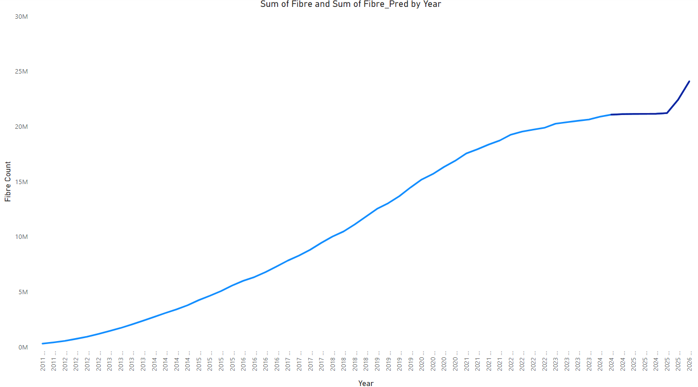
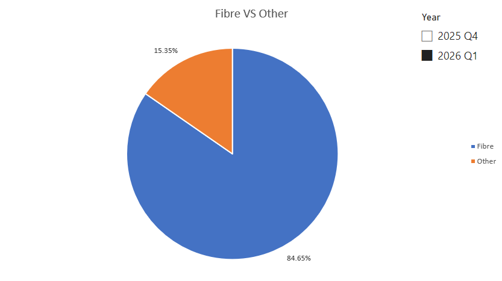

# Predictive Analysis of Uk Small Businesses and Residential Fibre Using Time Series

## Executive Summary

The Uk government has set targets for fibre broadband to be available to 85% of the Uk by 2025 and nationwide 2030 (Clark, 2023). To check whether or not the government will meet this target, I will apply a time series model to the following data set provided from Ofcom (Ofcom, 2024). This outcome of this project is to determine whether or not Uk Governments target is realistic. The results could affect not only affect economic performance (Sanyika and Roxburgh, 2011) but also voter confidence in meeting targets.
To ensure the success of the project I will follow a proven model (Yu, 2021), which will help with ensuring the accuracy of the data. Furthermore, so that I make sure to select the best trend which not only looks good but is conservative alongside the historical data. 

## Data Infrastructure & Tools
As the original file is in .CSV format, transformation was carried out in Excel. This made it easy to validate and transform the data. Being able to compare the results within EXCEL using graphs helps contribute towards the model. Next it was uploaded into Power BI for visualisation. This is because can Powerbase allows easy ingestion and can provide interactive graphs for visualisation.
The data was sourced from OFCOM (Wikipedia, 2019) which is a government approved regulatory. As a result, the data will have a higher accuracy and data integrity (Jones, 2024). Furthermore, as the data is open to the public this means it adheres to the latest GDPR regulations (Government of UK, 2018). 
As the model is using data during the Covid-19 period, this creates a challenge in providing an accurate prediction due to seasonal patterns which were not present pre-pandemic. This is why I’ve chosen to only forecast for 2 years.

## Data Engineering
As I followed a standard Extract Transform and Load (AWS, 2022) model, there are a number of processes I have to follow to ensure the adhere to the guidelines set. 

Dataset was downloaded from the Ofcom website and stored into a local directory. 
Although the dataset is from a government approved regulatory I will perform my own data integrity checks before transformation. To ensure data accuracy throughout the process.

First, I had to multiply the figures by 1000 as the table was showing smaller integers for ease of viewing. I also created a separate column to show % and compared with the footnotes given on the OFCOM website.

To check for NULL values, I used the “ISBLANK” function, and ran an integer check to make sure there were no STRINGS. This is because any NULL values can affect the results especially when working with trend lines and seasonal variations. 

Before transforming the data, I plotted the figures onto a Line graph to select the best trend line. There was no seasonality or cycles exhibited this could be due to not enough points during the fiscal year. This resulted in the moving average of 4 seemed to have the best fit. This also works well as there are 4 quarters in a fiscal year which creates 4 averages.
To work out the 4-point AVG firstly I had to work out the Trend, which is done by using the function below.

Next was to work out seasonality which is basically taking away the seasonality from the Fibre count

Using this we can work out the Mean seasonal variation for each fiscal quarter.

Now we can apply the mean seasonal variation to predict the future values.

Final step was to save the final output to CSV and upload into powerbase for creating the dashboard and graphs. This is because it allows for easy ingestion as it’s a Microsoft product. And the advanced data visualisations will help to show the results of my project more clearly. 

## Data Visualisation & Dashboards

As you can see from the Line graph with the predicted values it shows a gradual trend with spike towards the Q1 2026, which means I made the correct decision not predict past this point. Now the final value could be outlier and will need to taken with caution even if the threshold of 85% was not met. This is because it could offer a false narrative that the prediction is closer than it appears. Hovering over a single point can provide accurate figures for more experienced users. 

The Pie graph shows even with the spike in Q1 2026 the UK will not meet its target of 85% by 2025 using the 4-point moving average. Using the slicer, I can go all the way back to 2007 Q1 and is interactive making it easier to view data. As the chart would more than likely end up in non-technical hands, it needs to be easy to use.

## Conclusion

The purpose of the project was to determine whether or not the government’s pledge to make Fibre available to 85% of the Uk was feasible or not. After completing the time series model on the Ofcom dataset, I can now conclude that they will not meet this target by the end of 2025. By using applying a times series model to the data set and using a 4-point moving average. And showing the results via analytical graphs.

I would recommend the government adjusts the target date or decreasing rollouts for upcoming areas. As this model was factoring in a more conservative average. In addition, the impact of the model extends to finance and growth of the country. As mentioned in my executive summary fibre availability has direct impact on the performance of the country in these key sectors.

In regards to the ethics, privacy and legality of the model, I feel like approach covered all the bases. This was done by firstly using a public dataset which is published by a government approved regulator. Secondly, I ensured the dataset met GDPR such as no private data that could link back to an individual. 

The one area where I feel like I needed to focus more on was bias, as someone who works in telecommunication industry I feel privileged to have a different view point to others. Furthermore, this could appear as bias from a third party who would see it as a conflict of interest which I believe needs to be highlighted in the executive summary. 
The limitations of this model lie in the fact I was only able to predict 2 fiscal years into the future. And researching a model or trend which could predict accurately and further could definitely be an improvement. 
For future models I would recommend to decrease the number of historical data especially when factoring in Covid-19 data. Also, I would like to automate the extraction via power automate to load directly into SQL table and run a procedure to carry out the transformation. This is so that when the next fiscal quarter report comes out the model can produce results faster. 

Finally, I would try forecast ETS function which is a built in Excel function to offer a different prediction, and compare with the 4-point moving average. This is so that I can check to see is mine more robust and a better check for outliers such as 2026 Q1. 

## References

AWS 2022. What is Extract Transform Load. AWS. [Online]. Available from: https://aws.amazon.com/what-is/etl/#:~:text=Extract%2C%20transform%2C%20and%20load%20(,and%20machine%20learning%20(ML)..

Clark, A. 2023. Gigabit broadband in the UK: Government targets, policy, and funding. commonslibrary.parliament.uk. [Online]. Available from: https://commonslibrary.parliament.uk/research-briefings/cbp-8392/.Government of UK 2018. Data Protection Act. GOV.UK. [Online]. Available from: https://www.gov.uk/data-protection.

Jones, E. 2024. Data Accuracy vs. Data Integrity: Similarities and Differences | IBM. Ibm. [Online]. Available from: https://www.ibm.com/think/topics/data-accuracy-vs-data-integrity#:~:text=Data%20accuracy%20refers%20to%20the%20degree%20to.

Manyika, J. and Roxburgh, C. 2011. The impact of the Internet on economic growth and prosperity [Online]. Available from: https://www.mckinsey.com/~/media/McKinsey/Industries/Technology%20Media%20and%20Telecommunications/High%20Tech/Our%20Insights/The%20great%20transformer/MGI_Impact_of_Internet_on_economic_growth.pdf.

Ofcom 2024. Telecommunications Market Data Update Q1 2024. Ofcom.org.uk. [Online]. Available from: https://www.ofcom.org.uk/phones-and-broadband/telecoms-infrastructure/telecommunications-market-data-update-q1-2024/.Wikipedia 2019. 

Ofcom. Wikipedia. [Online]. Available from: https://en.wikipedia.org/wiki/Ofcom.Yu, 

F. 2021. A thorough guide to Time Series Analysis. Medium. [Online]. Available from: https://towardsdatascience.com/a-thorough-guide-to-time-series-analysis-5439c63bc9c5.
